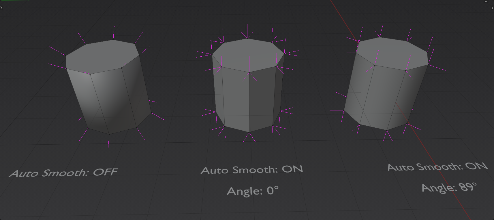

# WeaponBlender
The Hard Surface Game Asset Course 2.0

这个教程要放弃，不建议使用Boolean。用了太多n-gon。

### 1. Modelling1

#### 1.1 遇到一个bug

总是遇到一个bug，就是boxcutter在有些情况下，
按鼠标右键之后就没法调整形状了。

#### 1.2 machin3 tool 

https://machin3.gumroad.com/l/MACHIN3tools

可以对齐节点，功能很多。

#### 1.3 可以编辑的box cutter

在object模式下，ever scroll 

### 2. Modelling2

#### 2.1 auto smooth原理

https://blender.stackexchange.com/questions/259781/how-to-auto-smooth-in-geometry-nodes

根据我的理解，auto smooth是计算vertex per normal的平均值。

【29 模型法线Normal通识 1，平均法线，加权法线（理论）】https://www.bilibili.com/video/BV1ij411z7QQ?vd_source=dd0693a0880c6b173c9281441a6d9fc1

有个移动到

